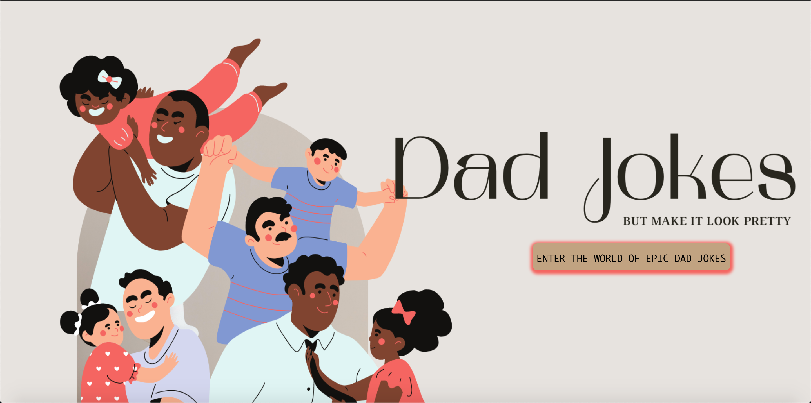

# UEA-DJ - [Mini Take-home Project] 
## Live Site: https://laugh-with-me.netlify.app/ 
### UEA-DJ is an interactive Frontend Applicatioon where visitors of the site can access random dad jokes and gifs. Users can also search for different jokes based on tags. 

Best viewed on Web.

Built with React.js.

### Lifetrest: Landing Page

### Lifetrest: Dashboard

### Lifetrest: Gif or Joke 

## Features
- Search for jokes based on keywords
- Randomize gifs through Giphy API
- Randomize jokes through "icanhazdadjoke" API

## Future Implementations
- Users will be able to search for gifs through GIPHY's API

# Technical Milestones
- Building on API knowledge
- useQuery to aide with API call to GIPHY 

# Technologies Used
- React [frontend]

## Frontend Deployment: Netlify

